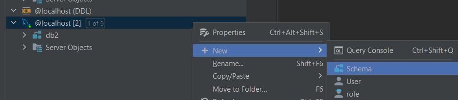

# Project Description

This is an event ticketing platform that allows organizations to post events and participants to join them.
Users can register and log in as either a participant or organization and will be directed to their respective home page.
It allows users to register and login as one member of the parties, and direct the user to the home page depending on the user type.

If the user is a participant, the home page will have a search engine, a button to show notifications for the user, and a few other buttons which will direct the user to other pages.
- Search Engine: the participant can input the keywords and select if he/she wants to search for events or organizations. 
The result page will include all items that contains the input string in their title/username.
Further, actions can be done on the result page.
- Show Notification: the notification is either generated by actions from organization or sent by the system informing important notice regarding the change of status of relevant events.
All notifications will show up together and can be only seen once.
- Account Page: the participant can choose to reset password here.
- Upcoming Event Page: the participant can see all the upcoming events that are previously joined, he/she can check the event details, and can choose to leave the event.
- Past Event Page: the participant can see the records of the past events that are joined, event details are still available to see, but the records cannot be removed.
- Followed Organization Page: the participant can see all the organization that are followed, and can choose to unfollow any of them.

If the user is an organization, the home page will only have buttons that direct the user to other pages.
- Action Page: the organization can choose to reset password here.
- Unpublished Event Page: the organization create, edit, delete new events here before publish them.
- Upcoming Event Page: as the organization publishes an event, the event will be moved here.
The organization cannot edit information of the events anymore, but can choose to delete them.
Deletion will be informed to participants who joined the event.
- Past Event Page: once the time of upcoming event has passed, it will be moved here.
All the events here can be seen as records, they cannot be removed.
- Follower Page: the organization can see the username of who have followed it.
The organization cannot remove followers.

All places where an event title has shown, the user can click and see its details.

All places where an organization username has shown, the participant can click and see its upcoming events.

We did not introduce the concept of price and budget to the system.
There is no caps of number of people attending for all events.

*Special Case to consider: We are using MySQL and DataGrip for data storage. Details will be explained in the Database section.*

## Starter File
`src/main/java/Main`

The starter file launches the Login Page.

There are 3 static variables in the file`src/main/java/database/JDBCUtils` that you might need to change to make the database working (How to use the database is down below):

- databaseUrl = "jdbc:mysql://localhost:3306/db2"
  - This is used for finding the database located in DataGrip.
- databaseUsername = "root"
  - This is the default username of your database, usually you will not need to change it.
- databasePassword = "vvks1309"
  - This is the password of your database, you need to set it when you are registering your account for your database.

The get methods of the above 3 static variables are used by `src/main/java/database`, these variables will be held fixed for all operations.

## Entities

We do not have the entities structure as we are using MySQL to store our data.

The data in the database are not in the form of Object-oriented programming (It works for all database). 
If we create an entity here, some private attribute would be a list of other entity object.
While the dependency relationship between two entities are described as an independent table in database.
It would be performance-costly when we generate all the objects from the database.
Accessing database and making changes on the database would be convenient in both developing and saving program time costs.

But from the concept perspective, we have *event*, *organization*, and *participant* to be responsible for the Enterprise Business Rules.

Only for demonstration purposes, each of those has the following attributes:

- Event
  - String organization: the username of the organization who launched the event.
  - String title: the title of the event.
  - *editable* String description: the description of the event.
  - *editable* String location: the location of the event.
  - *editable* ArrayList<Integer\> time: the time of the event, consists of year, month, day, hour, minute.
- Organization (User)
  - String username: the username of the organization.
  - *editable* String password: the password of the organization.
  - *editable* ArrayList<String\> unpublishedEvents: the titles of events in the "draft box" of the organization. The organization can create new events. The organization can choose to change any information of existing events except for their title. The organization can also choose to delete the events here.
  - *editable* ArrayList<String\> upcomingEvents: the titles of events that are published by the organization from the "draft box". At this point, the organization cannot change any information about the events, but can choose to delete them.
  - ArrayList<String\> pastEvents: the titles of events which are published and whose time are in the past (comparing with system time by LocalDateTime).
  - ArrayList<String\> followers: the usernames of the organization's followers (all are participants).
- Participant  (User)
  - String username: the username of the participant.
  - *editable* String password: the password of the participant.
  - *editable* ArrayList<String\> upcomingEvents: the titles of events that are published by the organization from the "draft box". At this point, the organization cannot change any information about the events, but can choose to delete them. 
  - ArrayList<String\> pastEvents: the titles of events which the participant joined and whose time are in the past (comparing with system time by LocalDateTime)
  - *editable* ArrayList<String\> followedOrganizations: the usernames of the participant's followed Organizations. The participant can choose to unfollow any of them.

*"*editable*" means the value of attribute can be changed by the user through means provided on UI.*

## Use Cases

All folders ending with use_case are the use cases of the project.
Each consists of 5 types of class/interface: InputBoundary, Interactor, OutputBoundary, RequestModel, ResponseModel (except for extract_information_use_case).

We have 17 use cases in total.
If the naming starts with user_, then the user type does not play a significant part for its Application Business Rules.
If the naming starts with par_, then the use case is specifically responsible for a functionality belongs to participant.
If the naming starts with org_, then the use case is specifically responsible for a functionality belongs to organization.

There are a few special use cases that are used in more than one place in the project, usually across the user types:
- `src/main/java/extract_information_use_case`: This is designed to assist views to show information stored in the database for Clean Architecture purposes. It is not tied to any specific type of user or screen.
- `src/main/java/upcoming_to_past_use_case`: This is an auto-triggered use case that do not need the user to explicitly demand for it. It will convert the user's all relevant upcoming events whose time is in the past (comparing with system time by LocalDateTime) to past events.
- `src/main/java/notify_event_use_case`: This is used to notify the user about changes or updates of relevant events. It can be called in various places in the project as the function is so commonly used.

## Database
`src/main/java/database`

*Important Setting to change: go to build.gradle, add dependency for MySQL: implementation 'mysql:mysql-connector-java:8.0.30'*

The database folder consists of 3 DsGateways and 3 FileUsers for event, organization, and participant. The FileUsers are directly connected to DataGrip. The guide for installing DataGrip and using the test database is at the end of this file.

Explain ALL tables in DataGrip, what does each of them do.

- eventfile:
   - Store the information of every event.
   - Contains row: title, description, location, year, month, day, hour, minute.
   - title have a primary key meaning it cannot be repeated.
- orgfile:
   - Store the information of every organization.
   - Contains row: username, password.
   - username is a primary key, so it cannot have repeat terms.
- parfile:
   - Store the information of every participant.
   - Contains row: username, password.
   - username is a primary key, so it cannot have repeat terms.
- unpublished_events_for_org:
   - When an organization create an event and make it a draft, the event should be stored at the eventfile but the relationship between the organization and the event are stored here.
   - Store the relationship of unpublished events and organizations.
   - This table is specifically used for unpublished events, published or past events should not show here.
   - Have two rows: org_username, event_title.
   - Org_username and event_title form a primary key together, means one pair of relationship can not show twice.
   - Foreign key of 'org_username' is linked to 'username' at orgfile and foreign key of 'event_title' is linked to 'title' at eventfile.
- past_events_for_org:
   - When an organization created an event, and the event have finished, the relationship between the event and the organization are stored here.
   - Store the relationship of past events and organizations.
   - This table is specifically used for past events, unpublished or upcoming events should not be here.
   - Have two rows: org_username, event_title.
   - Org_username and event_title form a primary key together, means one pair of relationship can not show twice.
   - Foreign key of 'org_username' is linked to 'username' at orgfile and foreign key of 'event_title' is linked to 'title' at eventfile.
- upcoming_events_for_org:
   - When an organization create an event, the event is going to happen in the future, its relationship with organization are stored here.
   - Store the relationship of upcoming events and organizations.
   - This table is specifically used for upcoming events, unpublished or past events should not be here.
   - Have two rows: org_username, event_title.
   - Org_username and event_title form a primary key together, means one pair of relationship can not show twice.
   - Foreign key of 'org_username' is linked to 'username' at orgfile and foreign key of 'event_title' is linked to 'title' at eventfile.
- past_events_for_par:
   - When a participant registered an event, and the event finished, the relationship between the event and the participant are stored here.
   - Store the relationship of past events and participants.
   - This table is specifically used for past events, upcoming events should not appear.
   - Have two rows: par_username, event_title.
   - Par_username and event_title form a primary key together, means one pair of relationship should not appear twice.
   - Foreign key of 'par_username' is linked to 'username' at parfile and foreign key of 'event_title' is linked to 'title' at eventfile.
- upcoming_events_for_par:
   - When a participant register an event, and the event will happen in the future, the relationship of them are stored here.
   - Store the relationship of upcoming events and participants.
   - This table is specifically used for upcoming events, past events should not appear.
   - Have two rows: par_username, event_title.
   - Par_username and event_title form a primary key together, means one pair of relationship should not appear twice.
   - Foreign key of 'par_username' is linked to 'username' at parfile and foreign key of 'event_title' is linked to 'title' at eventfile.
- follow_org_par:
   - If a participant followed an organization, the relationship are stored in this table.
   - Store the relationship of organizations and participants.
   - Have two rows: par_username, org_username.
   - Foreign key of 'par_username' is linked to 'username' at parfile and foreign key of 'org_username' is linked to 'username' at orgfile.
   - Par_username and org_username form a primary key together, meaning the following relationship pair cannot exist twice.
- par_notification:
   - When someone sent participant a notification, the relationship between the notification and the participant are stored.
   - Store the relationship of notification and participants.
   - Have two rows: par_username, notification.
   - Foreign key of 'par_username' is linked to 'username' at parfile.
   - Notification is a String, one username can be paired with multiple notifications.

## How to use database:
### How to download, install and initialize mysql connection:
This project require Mysql to be downloaded.
Installation Guide of MYSQL: https://www.javatpoint.com/how-to-install-mysql. 

When the installation is finished, our project require the mysql account and password to be remembered.
The JDBC require them to access the data from MYSQL.
The username and password should be updated at the src/main/java/database/JDBCUtils.java Line 7,8,9.

<!--suppress ALL -->

If username is changed by the user, the mysql username should be default value: root.
### How to use Datagrip to import the database and tables:
Install Datagrip first: https://www.jetbrains.com/datagrip/.  
After installation, click and open the Datagrip.
Go to the left part of the page, under Database Explorer, choose to create a new Data Source.

Pick MySQL under the Data Source list. 
It will create a localhost, enter the User(which is root) and Password(As previously set).

Click Test Connection below to verify it's successfully connected to the local MySQL server.

Click OK, the localhost is built. 
Then right-click the localhost, + New, Choose add a new Schema, create a database.

Copy the path of the database to the HelloWorld File, Line 17, the location of the local database need to be changed.

In the main/java/database_for_general.sql, it's out database default file, it contains no data.
Right-click the database created under localhost, choose import/export, click 'Restore with mysql', find and set the location of the mysql.exe and the location of the file database_for_general.sql. 
The whole table would be imported.

The whole table would be imported.

## SOLID Principles and Design Patterns

### SOLID Principles

- Single Responsibility: The modular approach we used ensures the workflow 
is separated into use cases with each class only having one
functionality and one reason to change.
- Open Closed Principle: We did not really use inheritance in our project, which is why
this principle does not really apply i.e. no extending other classes.
- Liskov Substitution Principle: This principle can be seen in our input and output
boundaries, the interactor and presenter implements input and output boundaries and are
subtypes of the input and output boundaries. Therefore, we substituted them in our program.
- Interface Segregation Principle: This principle can be seen in the gateways we
are using to access the database. We have three types for participant, organizer and event,
each of these gateways contain different methods for specific uses.
- Dependency Inversion Principle: we use input and output boundaries to adhere to this principle
and maintain the flow of control described in clean architecture.

### Design Patterns

- Iterator Design Pattern: The database is accessed by the MySQL command, when we need to access a list of anything ,
we will call the written command from the mysql to return a whole list, the java part of program do not need to know the details of table structure.
- Observer Design Pattern: We will use an interface that prepare the method that is contained
  For example, we will write something like EventDsGateway b = new EventFileUser(); 
  the eventDsGateway decide what necessary methods need to be containing so an object can notify an object without know what the object is.
- Strategy Design Pattern: Organizer and participant can reset the password through different page, each of them have a controller and presenter. 
Both of their presenter implement an interface of resetting password

### ClassNotFoundExceptions And SQLExceptions
- In the database branch codes, there's an unavoidable possibility that the Java program cannot access the MySQl.
It has multiple possible reasons: wrong username and password, non-existence Database or system blocking access.
- In our program, we throw them out, if something like this happens, it's going to show on the Terminal of Intellij.
- Normally if the database is successful installed and the username plus password both correct, we will not meet this exception.
- However, this exception do happen to exist so there's necessity to throw it out in every class that use the exception.
- SQLExceptions are different from ClassNotFoundExceptions, the SQL method used in JDBC are set by ourselves and there are 
method in Interactor that check if each variable used in JDBC command is correct. If other part of the program have no bugs, SQLExceptions are
expected to never happen. 

### Testing Database Import
- For each tests of use case, we have a SQL file allocated for them. 
- For each test, we need to create a new database in DataGrip, changing the username and password stored in JDBCUtils.java.
- And then we need to restore the sql file through MysqlDump.
  

- After successfully imported, click the test button to test them.

### Potential Bug for testing database importing
- Every computer may use a different encoding scheme, when importing the .sql file, we might meet problems of character sets.
- For this situation, we have no better solution but replacing all identify name in the sql file by Intellij auto replacement function.
- If the problem is about utf8mb4_0900_ai_ci, replace it with utf8_unicode_ci.
- If the problem is about utf8_unicode_ci, replace it with utf8mb4_0900_ai_ci.

